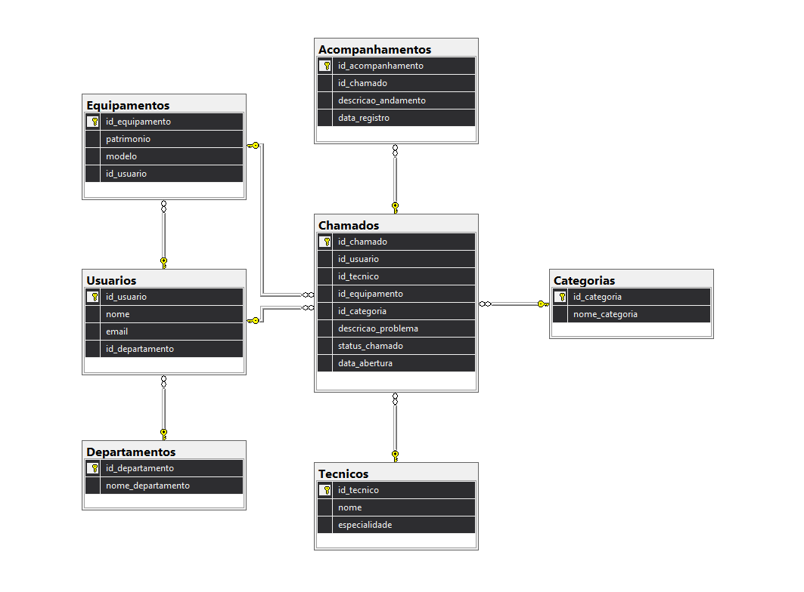

# 🖥️ Sistema de Suporte em TI

## 📋 Sobre o Projeto
Projeto Final (N1) desenvolvido para a matéria de Banco de dados II para gerenciar chamados de suporte técnico de TI.

**Banco de Dados:** SQL Server
* **Linguagem:** T-SQL
* **Ferramenta de Modelagem:** SQL Server Management Studio (SSMS)

## 🚀 Estrutura e Automações
O banco de dados foi construído seguindo as regras de normalização (3FN) e conta com:
* **Gatilhos (Triggers):** Automação (`TGR_STATUS`) que altera o status do chamado para 'Em Andamento' invisivelmente assim que um técnico registra um acompanhamento.
* **Funções (Functions):** Cálculo em tempo real dos dias em que um chamado permanece aberto.
* **Lógicas Condicionais:** Consultas customizadas utilizando `IIF`, `IF...ELSE` e `CASE WHEN` para categorização inteligente de prioridades e organização de prateleiras de hardware.
* **Testes de Estresse:** Implementação de loop `WHILE` simulando testes em lote na integração das câmeras.

## 🗂️ Diagrama de Entidade e Relacionamento (DER)

## 👨‍💻 Autor
* **Rhandal Reis Moura** - Engenharia de Computação
